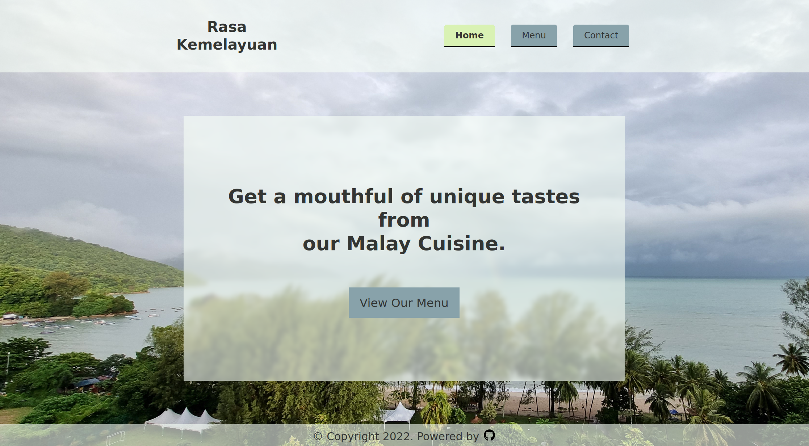

# Restaurant Page

> Create a restaurant page using webpack.
> Live demo [_here_](https://nabelk.github.io/restaurant-page/).

## Table of Contents

-   [General Info](#general-information)
-   [Technologies Used](#technologies-used)
-   [Tools](#tools)
-   [Features](#features)
-   [Screenshots](#screenshots)
-   [Contact](#contact)

## General Information

-   The project is a part of The Odin Project: Full Stack JavaScript.
-   Display restaurant information such as menu, location, and hours of operation.

## Technologies Used

-   HTML
-   CSS
-   Javascript

## Tools

### Webpack

    Use of webpack for building and bundling the project.

### Prettier && eslint

    For finding erros and formatting on save (vscode).

## Features

-   Responsive design for optimal viewing on various devices.
-   To improve maintainability, the page has been separated into individual modules, each with their specific functionality.

## Screenshots

## Contact

Created by [@nabelk](https://www.linkedin.com/in/nabil-khalid-36791a241/) - feel free to contact me!
